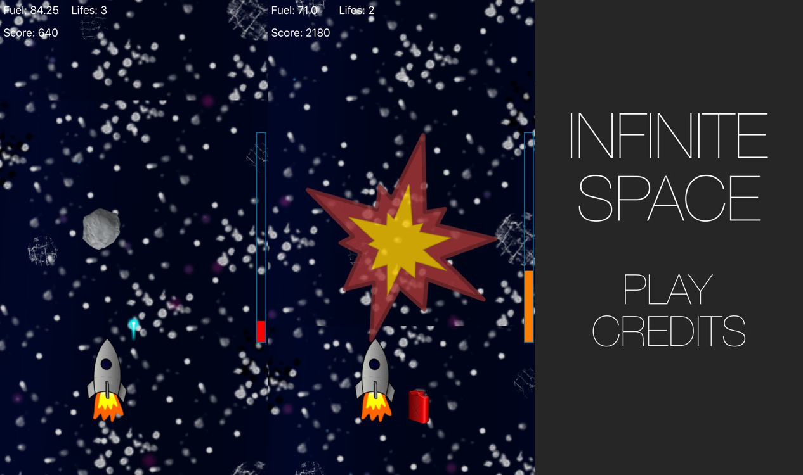
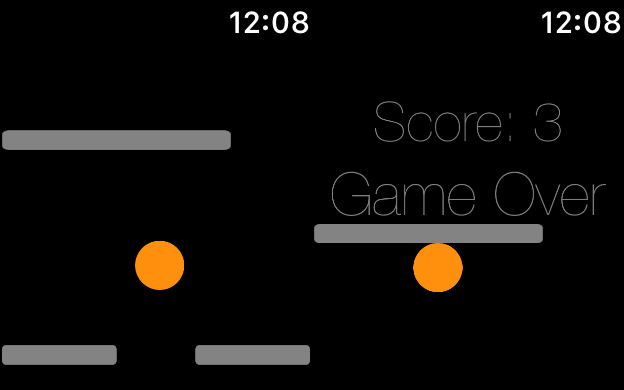
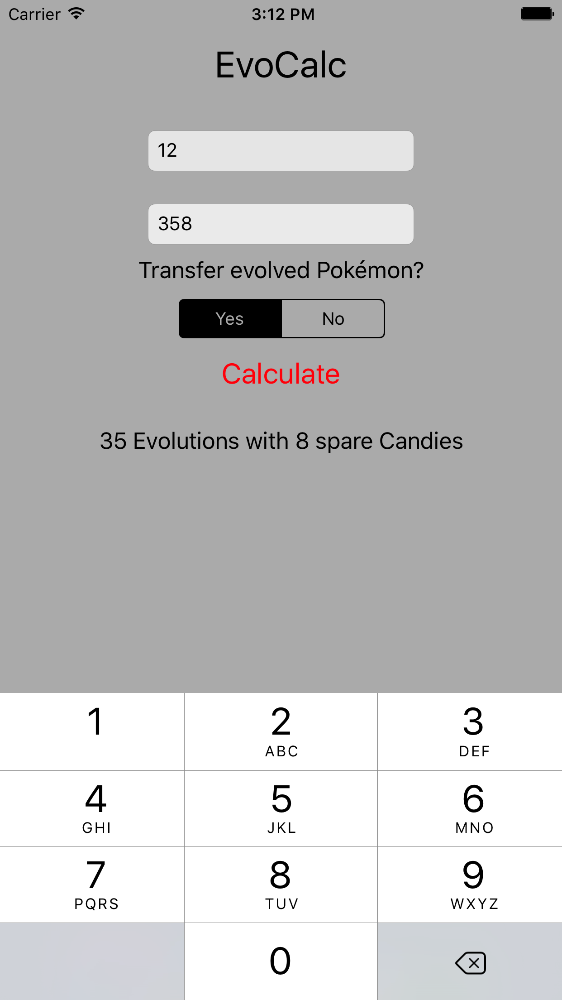

## Florian Schweizer, B.Sc. Informatik: Games Engineering

# Profile
- 23 years old
- currently studying M.Sc. Informatik: Games Engineering
- had 2 Apps on iOS and 1 App on watchOS AppStore
- working on more iOS Apps to be released soon

# Current Projects
## Habits
- iOS, not yet released
- SwiftUI, CoreData (CloudKit), WidgetKit
- simple habit tracker incl. statistics

## MyWorkout
- iOS, not yet released
- SwiftUI, CoreData (CloudKit), UserNotifications
- create, manage and do workouts - all in one app

## ReCharge
- iOS, university project for Quartett Mobile GmbH
- SwiftUI, CoreData, CoreML, HealthKit, Combine, WidgetKit, WatchKit, Lottie
- recharge yourself during your electric car's charging break with activities from four unique categories

# Portfolio
## The Infinite Space
- iOS, released 2016 (not available anymore)
- SpriteKit, CoreMotion
- motion-controlled space shooter game

## Warynth
- watchOS, released 2016 (not available anymore)
- UIKit for watchOS, built before SpriteKit watchOS release
- digital-crown controlled labyrinth game

## EvoCalc
- iOS, released 2016 (not available anymore)
- UIKit
- recursive candy calculator for Pokémon Go

