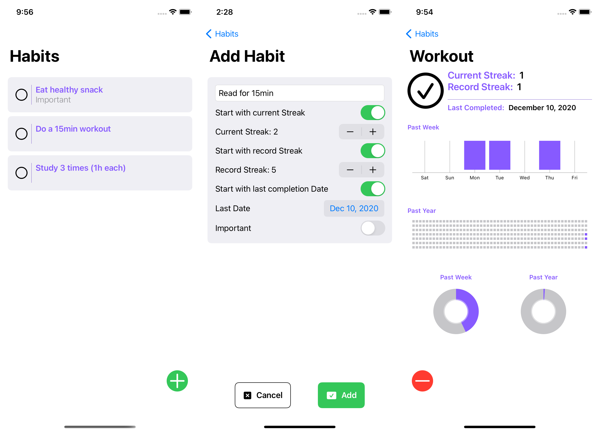
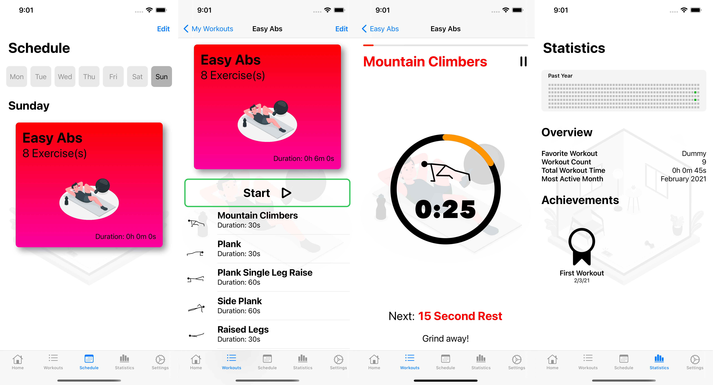
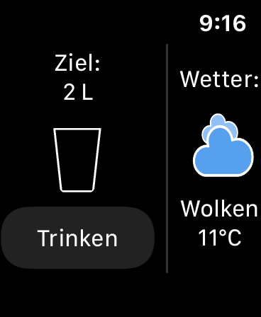
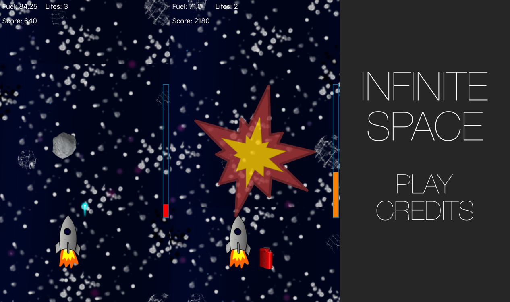
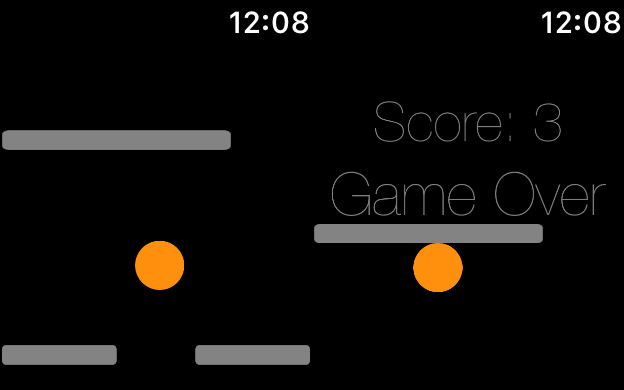
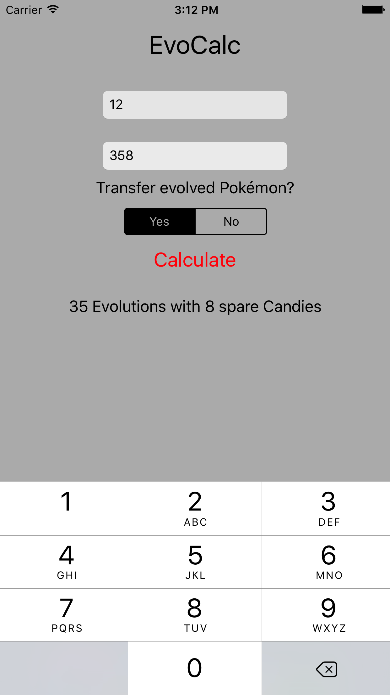

## Florian Schweizer, B.Sc. Informatik: Games Engineering

# Profile

- 23 years old
- Currently studying M.Sc. Informatik: Games Engineering
- 2 Apps on iOS and 1 App on watchOS AppStore
- Working on more iOS Apps to be released soon

# Current Projects
## Habits
- iOS, not yet released
- SwiftUI, CoreData (CloudKit), WidgetKit
- simple habit tracker incl. statistics

## MyWorkout
- iOS, not yet released
- SwiftUI, CoreData (CloudKit), UserNotifications, HealthKit
- create, manage and do workouts - all in one app

<a href="myworkout/index.html">Learn More</a>

## ReCharge
- iOS, university project for Quartett Mobile GmbH
- SwiftUI, CoreData, CoreML, HealthKit, Combine, WidgetKit, WatchKit, Lottie
- recharge yourself during your electric car's charging break with activities from four unique categories
### preview images tbd

# Portfolio
## Senior Companion
- watchOS, bachelor's thesis (2020)
- WatchKit, SwiftUI, CoreLocation, CoreBluetooth
- Apple Watch app, "Smart Watch Application Supporting Elderly Built on Adapted Design Guidelines"

## The Infinite Space
- iOS, released 2016
- SpriteKit, CoreMotion
- motion-controlled space shooter game

## Warynth
- watchOS, released 2016
- UIKit for watchOS, built before SpriteKit watchOS release
- digital-crown controlled labyrinth game

## EvoCalc
- iOS, released 2016
- UIKit
- recursive candy calculator for Pokémon Go

## SocNet
- Web, unreleased ~2011
- PHP, Javascript, MySQL
- social network featuring profiles, image upload, online status, direct messages, message groups
### preview images tbd

## Battle of Oceans
- Web, unreleased ~2012
- PHP, Javascript, MySQL
- one of the many browser games I developed in my early programming career
### preview images tbd
